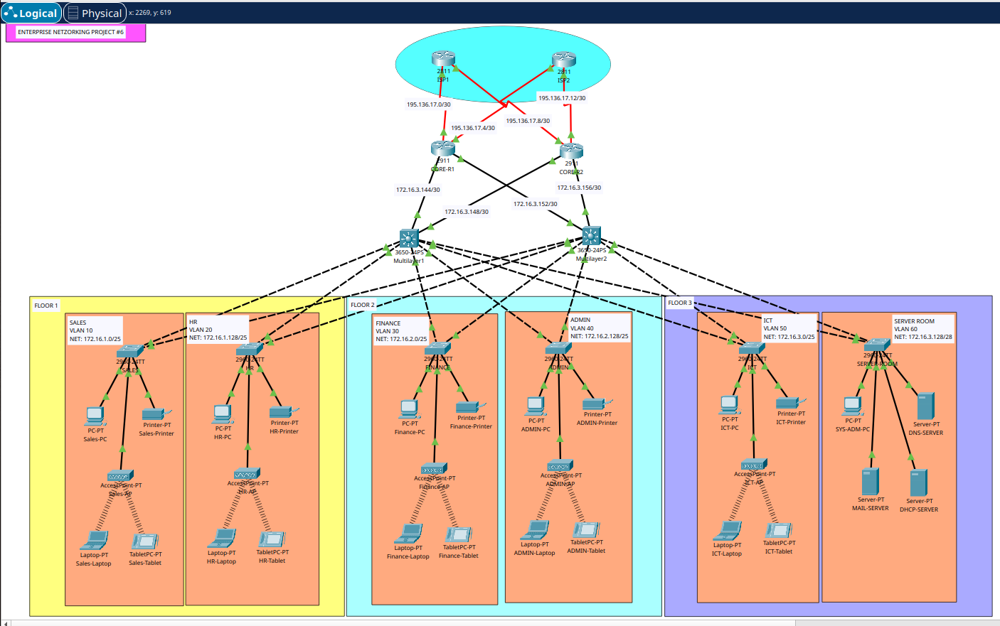

# Company Network Design

## Description

This project is inspired by [Gurutech](https://www.youtube.com/@gurutechnetworks). It helped me refresh my knowledge of Packet Tracer and allowed me to recreate an enterprise network before working on my final Bachelor project, which you can find here: [SecureMultiSiteNetwork](https://github.com/Wemubis/Packet-Tracer/tree/main/SecureMultiSiteNetwork).

In this repository, you will find the configuration files, the network topology as a `.png` image, and a brief explanation of the architecture used.

 

## Network Topology

The network is divided into multiple VLANs across three floors:

- **Floor 1:**  
  - Sales (VLAN 10) - `172.16.1.0/25`
  - HR (VLAN 20) - `172.16.1.128/25`

- **Floor 2:**
  - Finance (VLAN 30) - `172.16.2.0/25`
  - Admin (VLAN 40) - `172.16.2.128/25`

- **Floor 3:**  
  - ICT (VLAN 50) - `172.16.3.0/25`
  - Server Room (VLAN 60) - `172.16.3.128/28`

The network is interconnected using **Layer 2 (L2) switches** and **Layer 3 (L3) switches**, with **OSPF-based routing** to ensure connectivity between VLANs and core routers.

 

## Device Configuration

### 1. Layer 2 (L2) Switches

L2 switches provide endpoint connectivity and enforce security policies:
- Configuring ports as **trunk** or **access**
- Securing ports using **switchport security**
- Managing VLANs

Configuration file: [`SwitchL2.ini`](./ConfigFiles/SwithL2.ini)

### 2. Layer 3 (L3) Switches

L3 switches handle **inter-VLAN routing** and participate in OSPF routing:
- Creating VLANs and VLAN interfaces
- Enabling IP routing
- Configuring **OSPF** for route distribution

Configuration file: [`SwitchL3.ini`](./ConfigFiles/SwitchL3.ini)

### 3. Routers

Routers ensure external connectivity and network redundancy with **OSPF and WAN interfaces**.

Configuration file: [`CoreRouter.ini`](./ConfigFiles/CoreRouter.ini)

 

## Objectives & Improvements

- Simulate an enterprise network with **efficient VLAN segmentation**
- Ensure high availability with **OSPF and multi-layer routing**
- Apply **security rules on switches**
- Experiment with **advanced configurations before the final project**
